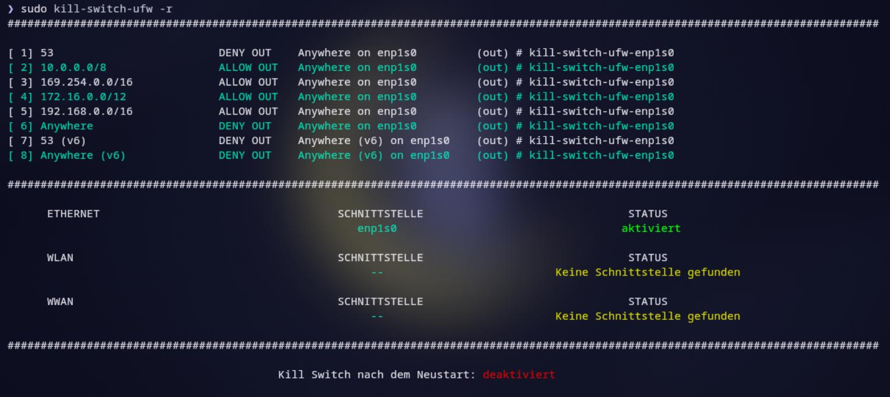
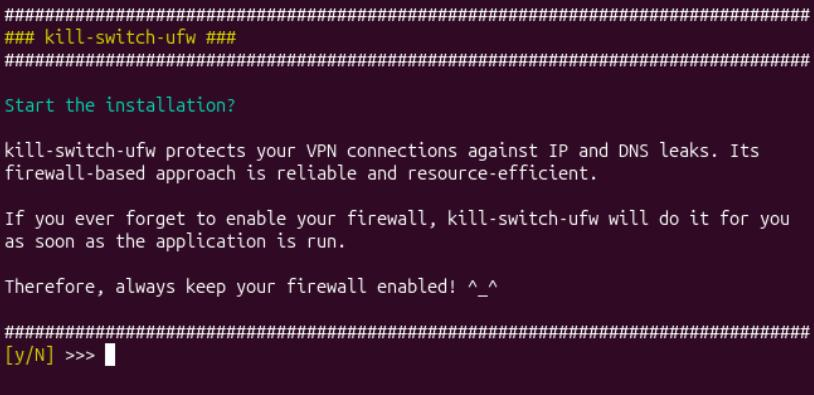

<a id="top"></a>

<div align="center">
  <h1>🛡️ kill-switch-ufw</h1>
  <p><strong>Firewall-based VPN leak protection for Linux</strong></p>
  <p>Reliable · Lightweight · No background daemon</p>
  <p>
    <code>Bash 5.0+</code>&nbsp;&nbsp;
    <code>UFW</code>&nbsp;&nbsp;
    <code>NetworkManager</code>&nbsp;&nbsp;
    <code>9 language packs</code>
  </p>
  <p>
    <a href="#deutsch">🇩🇪 Deutsch</a> ·
    <a href="#english">🇬🇧 English</a> ·
    <a href="#espanol">🇪🇸 Español</a>
  </p>
</div>

---

<a id="deutsch"></a>




## 🇩🇪 Deutsch

`kill-switch-ufw` ist eine zuverlässige und leichtgewichtige Lösung für alle,
denen routingbasierte Kill-Switch-Lösungen nicht ausreichen.

Fast jeder kennt das Problem: Die VPN-Anwendung stürzt ab oder verursacht einen
Fehler und damit versagt meist auch die routingbasierte Absicherung.
`kill-switch-ufw` schließt diese Lücke, indem es ausgehenden Datenverkehr
außerhalb des VPN-Tunnels über LAN-, WLAN- oder WWAN-Schnittstellen blockiert.
Welche Schnittstellen geschützt werden, entscheidest du.

Das Programm erkennt deine physischen Schnittstellen und VPN-Verbindungen und
erstellt maßgeschneiderte Regeln für die UFW-Firewall, damit deine Privatsphäre
nicht länger ein Glücksspiel bleibt.

Kein dauerhaft laufender Dienst, der abstürzen oder versagen kann – die Regeln
sind bereits aktiv, wenn sich ein Paket verirrt.

### Systemanforderungen

- **systemd**
- Bash 5.0 oder höher
- UFW
- NetworkManager (`nmcli`)
- wireguard-tools

Auf vielen Systemen bereits vorinstalliert. Fehlende Tools können über den 
Installer nachinstalliert werden.


#### Installation

1. Mache die Datei `install.sh` ausführbar:

   ```bash
   sudo chmod +x install.sh
   ```

2. Starte die interaktive Installation:

   ```bash
   sudo ./install.sh
   ```

3. Lerne die verfügbaren Optionen kennen:

   ```bash
   kill-switch-ufw --help
   ```

#### Deinstallation

Rufe die Installationsdatei mit dem Parameter `uninstall` auf:

```bash
sudo ./install.sh uninstall
```

### Sprachpakete

`DE` · `EN` · `FR` · `ES` · `IT` · `PL` · `ZH` · `RU` · `HI`

<p align="right"><a href="#top">Nach oben ↑</a></p>

---

<a id="english"></a>

## 🇬🇧 English

`kill-switch-ufw` is a reliable, lightweight solution for anyone who considers
routing-based kill switch solutions insufficient.

Almost everyone knows the problem: The VPN application crashes or encounters
an error, and the routing-based protection usually fails along with it.
`kill-switch-ufw` closes this gap by blocking outbound traffic outside the VPN
tunnel on LAN, WLAN, or WWAN interfaces. You decide which interfaces are
protected.

The program detects your physical interfaces and VPN connections and creates
tailored rules for the UFW firewall, so your privacy is no longer left to
chance.

No permanently running service that can crash or fail – the rules are already
in place when a packet goes astray.

### System requirements

- **systemd**
- Bash 5.0 or later
- UFW
- NetworkManager (`nmcli`)
- wireguard-tools

These tools come preinstalled on many systems. Any missing tools can be installed 
using the installer.


#### Installation

1. Make the `install.sh` file executable:

   ```bash
   sudo chmod +x install.sh
   ```

2. Start the interactive installation:

   ```bash
   sudo ./install.sh
   ```

3. View the available options:

   ```bash
   kill-switch-ufw --help
   ```

#### Uninstallation

Run the installation file with the `uninstall` parameter:

```bash
sudo ./install.sh uninstall
```

### Language packs

`DE` · `EN` · `FR` · `ES` · `IT` · `PL` · `ZH` · `RU` · `HI`

<p align="right"><a href="#top">Back to top ↑</a></p>

---

<a id="espanol"></a>

## 🇪🇸 Español

`kill-switch-ufw` es una solución fiable y ligera para quienes consideran
insuficientes las soluciones de kill switch basadas en el enrutamiento.

Casi todo el mundo conoce el problema: la aplicación VPN se bloquea o genera
un error y la protección basada en el enrutamiento suele fallar con ella.
`kill-switch-ufw` cubre esta carencia bloqueando el tráfico
saliente fuera del túnel VPN a través de las interfaces LAN, WLAN o WWAN.
Tú decides qué interfaces se protegen.

El programa detecta tus interfaces físicas y conexiones VPN y crea reglas a
medida para el cortafuegos UFW, de modo que tu privacidad deje de depender del
azar.

No hay ningún servicio en ejecución permanente que pueda bloquearse o fallar:
las reglas ya están activas cuando un paquete se desvía.

### Requisitos del sistema

- **systemd**
- Bash 5.0 o superior
- UFW
- NetworkManager (`nmcli`)
- wireguard-tools

Estas herramientas vienen preinstaladas en muchos sistemas. Las que falten pueden
instalarse mediante el instalador.


#### Instalación

1. Haz ejecutable el archivo `install.sh`:

   ```bash
   sudo chmod +x install.sh
   ```

2. Inicia la instalación interactiva:

   ```bash
   sudo ./install.sh
   ```

3. Consulta las opciones disponibles:

   ```bash
   kill-switch-ufw --help
   ```

#### Desinstalación

Ejecuta el archivo de instalación con el parámetro `uninstall`:

```bash
sudo ./install.sh uninstall
```

### Paquetes de idioma

`DE` · `EN` · `FR` · `ES` · `IT` · `PL` · `ZH` · `RU` · `HI`

<p align="right"><a href="#top">Volver arriba ↑</a></p>
